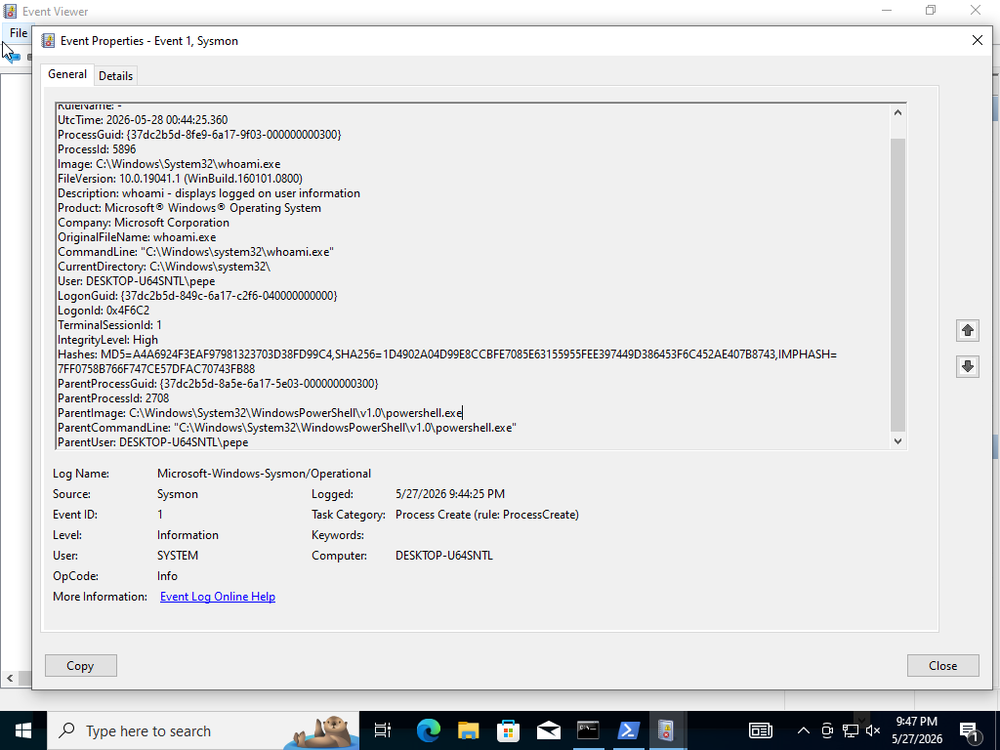
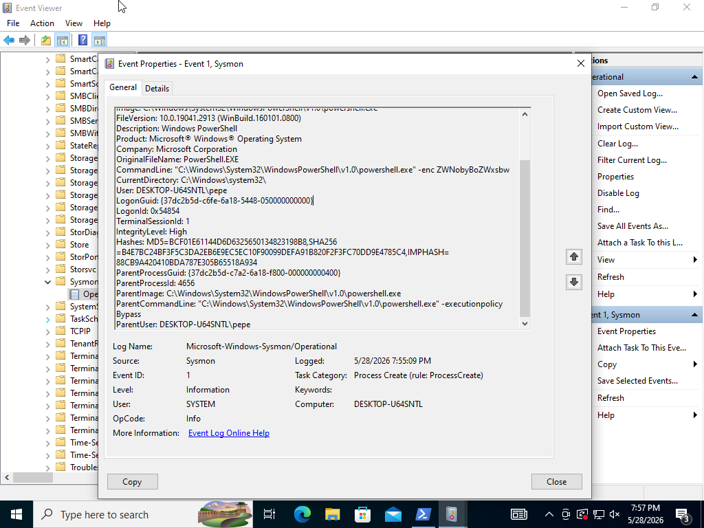
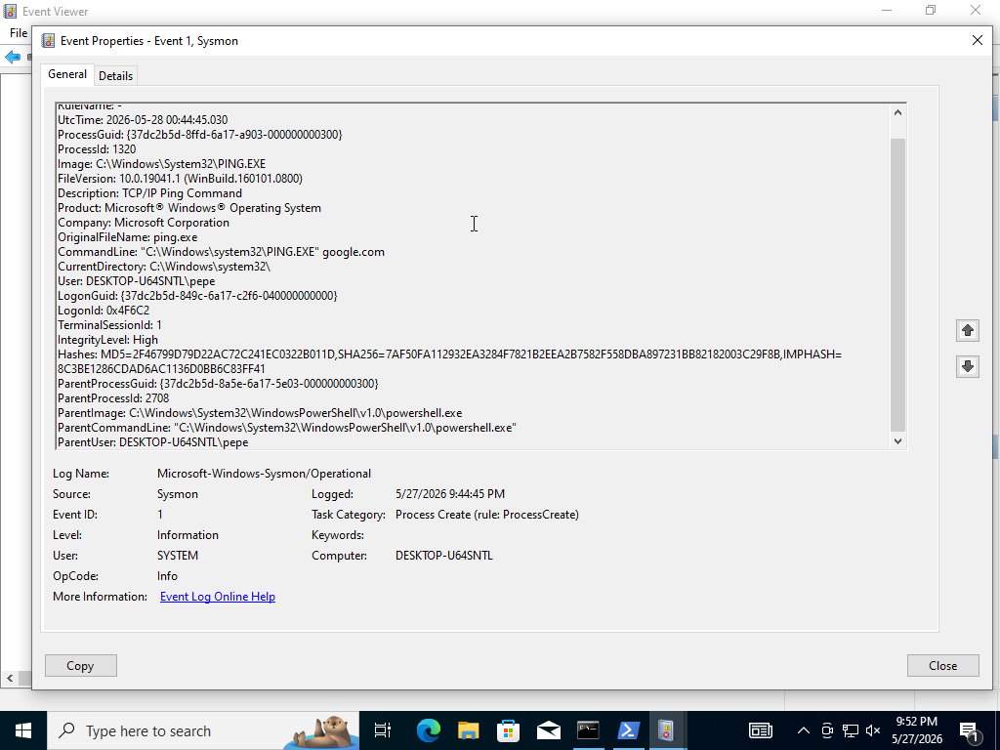

# Análisis de Logs y Detección de Procesos con Windows Sysmon

## Objetivo
El objetivo de este proyecto es demostrar habilidades prácticas de Blue Team mediante la monitorización, recolección y análisis de logs de eventos en Windows utilizando **Microsoft Sysmon**. Se simularon comandos tanto comunes como potencialmente maliciosos desde la terminal para documentar cómo un Analista SOC puede identificar patrones de ejecución, anomalías y técnicas de evasión.

## Herramientas Utilizadas
* **Windows 10** (Entorno virtualizado en Oracle VirtualBox)
* **Microsoft Sysmon v14+** (System Monitor)
* **Windows PowerShell / CMD** (Para la ejecución de comandos)
* **Windows Event Viewer** (Visor de Eventos para análisis forense de logs)

---

## Pasos Realizados

### 1. Instalación y Despliegue
* Se configuró e instaló Sysmon en la máquina virtual utilizando privilegios de administrador para capturar la creación de procesos (`Event ID 1`) y conexiones de red (`Event ID 3`).

### 2. Ejecución y Simulación de Comandos
Se ejecutaron comandos de reconocimiento de sistema y red, simulando las primeras etapas de un ataque (Reconnaissance & Discovery) o el uso de técnicas de evasión (Defacement/Obfuscation).

### 3. Análisis de Evidencias en el Visor de Eventos
A través de la ruta `Registros de aplicaciones y servicios -> Microsoft -> Windows -> Sysmon -> Operational`, se aislaron los eventos generados.

---

## Análisis Forense de los Eventos (Findings)

A continuación se detallan los hallazgos clave mapeados desde el Visor de Eventos:

### Caso 1: Ejecución de Comandos de Reconocimiento (`whoami`)
* **Descripción:** Comandó típico utilizado por atacantes para identificar los privilegios del usuario actual tras comprometer una máquina.
* **Análisis del Log (Event ID 1):** * `Image`: Muestra la ruta real del binario legítimo ejecutado (`C:\Windows\System32\whoami.exe`).
  * `ParentImage`: Nos indica que fue lanzado desde `powershell.exe`. Esto permite trazar la línea de ejecución.
 

---

### Caso 2: Simulación de Evasión - Comando PowerShell Encriptado (`-enc`)
* **Análisis Crítico:** Este es el hallazgo más importante para un perfil SOC. Los atacantes suelen usar el parámetro `-enc` o `-ExecutionPolicy Bypass` en PowerShell para evadir políticas de restricción del sistema y ocultar scripts maliciosos en Base64.
* **Análisis del Log (Event ID 1):**
  * `CommandLine`: Captura el comando completo, incluyendo el String ofuscado (`-enc ZWNobyBoZWxsbw==`). Como analistas, esto nos alerta instantáneamente para decodificar el contenido (que en este caso traduce un simple `echo hello`).
  * `IntegrityLevel`: Muestra `High`, indicando que el proceso corrió con altos privilegios.

---

### Caso 3: Monitoreo de Red mediante Ping a Google
* **Descripción:** Verificación de conectividad externa.
* **Análisis del Log (Event ID 1):**
  * `CommandLine`: Registra `PING.EXE google.com`. En un entorno real, esto nos ayuda a detectar si un malware está intentando verificar si la máquina comprometida tiene salida a Internet (Beaconing o Connection Check).

---

## Conclusión
Este proyecto demuestra cómo **Sysmon** expande drásticamente las capacidades de auditoría nativas de Windows. Mientras que los logs estándar de Windows pueden pasar por alto los argumentos específicos de un comando, Sysmon registra con precisión la línea de comandos completa (`CommandLine`), los hashes del binario para comprobar su reputación (MD5/SHA256) y el proceso padre (`ParentImage`). 

Entender estas trazas es fundamental para un **Analista SOC Junior** para la creación de reglas de detección de amenazas y la investigación de incidentes en entornos corporativos.
